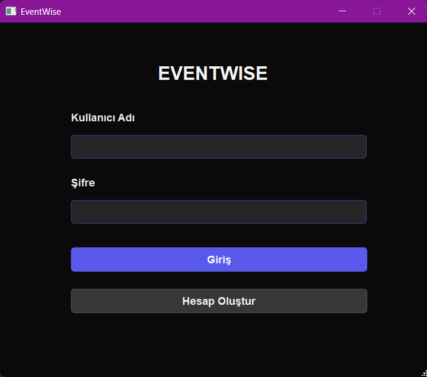
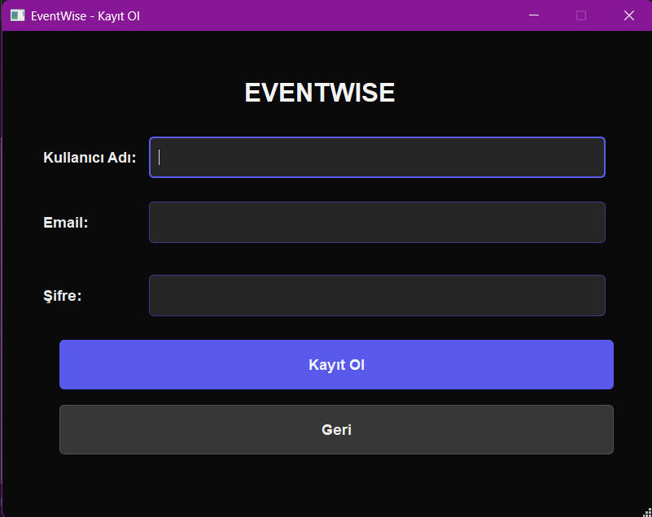
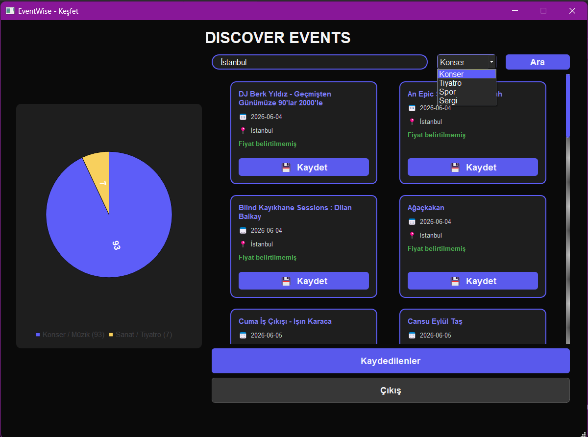
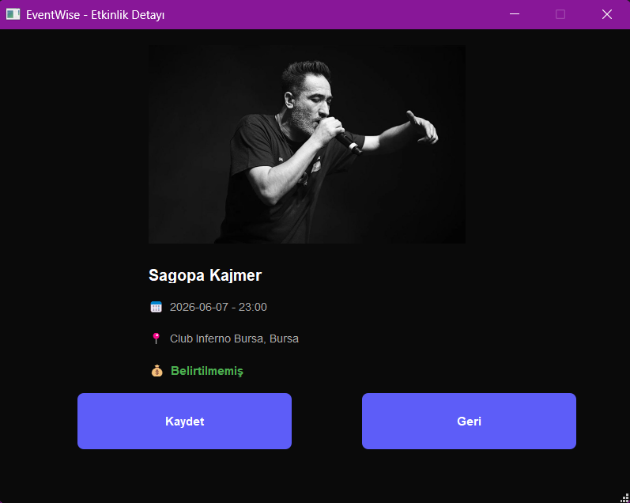
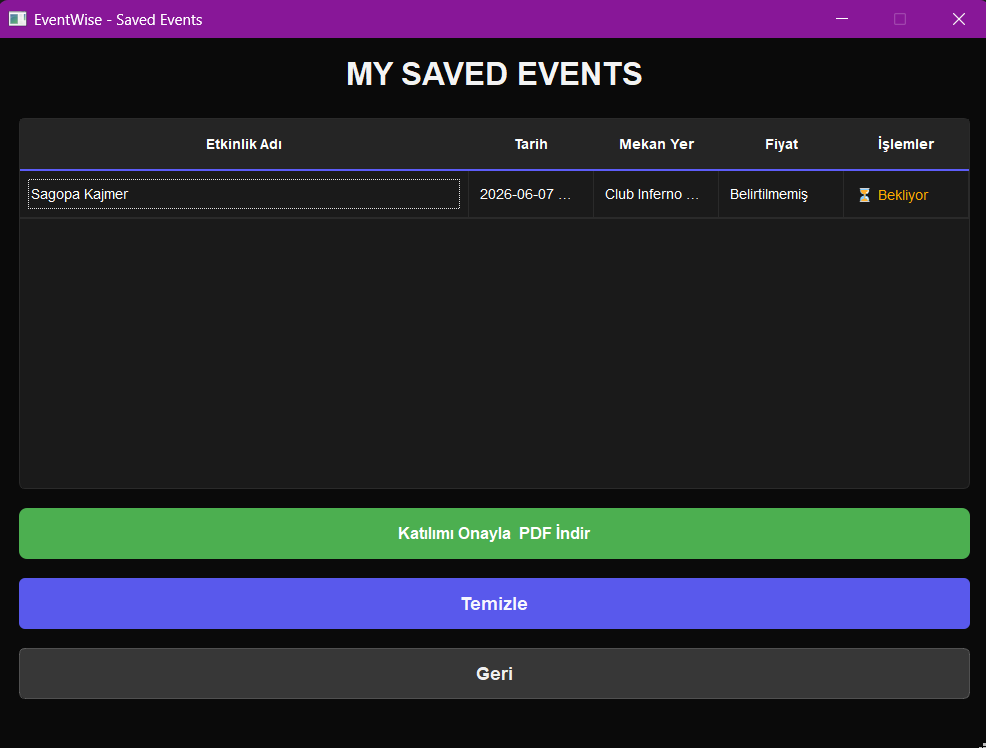
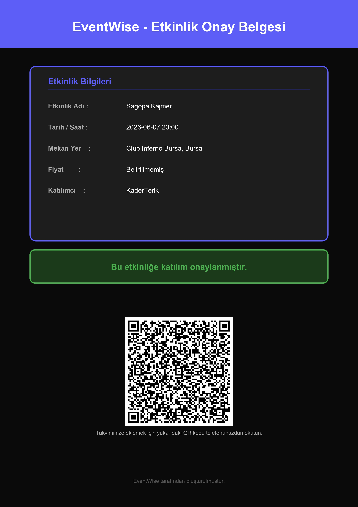
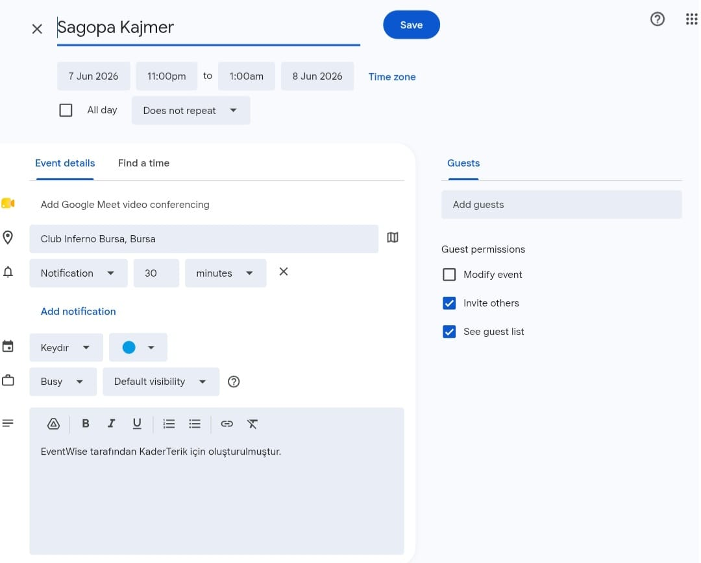

# 🎫 EventWise - Smart Event Discovery & Management System

<div align="center">

### Discover • Save • Manage • Attend

Modern bir masaüstü uygulaması: Ticketmaster API ile dünya genelindeki etkinlikleri keşfedin, favorilerinize ekleyin ve Google Takvim entegrasyonlu QR kodlu PDF onay belgesi oluşturun.

</div>

---

## 📖 Proje Hakkında

EventWise, Python ve PyQt5 ile geliştirilmiş masaüstü tabanlı bir etkinlik keşif ve yönetim platformudur.

Ticketmaster Discovery API üzerinden anlık etkinlik bilgilerini çekerek kullanıcılara şunları sunar:

- Dünya genelinde etkinlik arama
- Şehir ve kategoriye göre filtreleme
- Favori etkinlikleri kaydetme
- Etkinlik detaylarını ve afişlerini görüntüleme
- Kişiselleştirilmiş PDF onay belgesi oluşturma
- QR kod ile etkinlikleri Google Takvim'e ekleme

---

## ✨ Özellikler

### 👤 Kullanıcı Yönetimi

- Kullanıcı kaydı ve giriş sistemi
- SQLite tabanlı güvenli kullanıcı depolama
- Oturum yönetimi

### 🔍 Anlık Etkinlik Keşfi

Ticketmaster Discovery API v2 ile şehir, anahtar kelime ve kategori bazlı arama:
Konserler • Spor Etkinlikleri • Tiyatrolar • Sergiler • Festivaller

### 📊 İnteraktif Analiz Grafiği

- Etkinlik kategori dağılımını gösteren animasyonlu pasta grafiği
- PyQtChart entegrasyonu ile dinamik güncellemeler

### 🖼️ Etkinlik Detay Ekranı

- Etkinlik afişi
- Mekan, tarih, saat ve fiyat bilgileri

### ❤️ Favori Etkinlikler

- İlginç etkinlikleri kaydetme ve kişisel arşiv oluşturma
- Kaydedilen etkinlikleri yönetme ve silme

### 📄 QR Destekli PDF Onay Belgesi

ReportLab ve qrcode kütüphaneleri ile üretilen kişiye özel PDF:

- Kullanıcı ve etkinlik bilgileri
- QR kod ile Google Takvim entegrasyonu

## 🛠️ Kullanılan Teknolojiler

| Alan           | Teknoloji                       |
| -------------- | ------------------------------- |
| Dil            | Python 3                        |
| Arayüz         | PyQt5 + Qt Designer (.ui) + QSS |
| Veritabanı     | SQLite3                         |
| Asenkron Yapı  | QThread & pyqtSignal            |
| Raporlama      | ReportLab + qrcode              |
| API            | Ticketmaster Discovery API v2   |
| HTTP İstekleri | Requests                        |

---

## 💻 Kurulum

### 1. Projeyi klonlayın

```bash
git clone https://github.com/kullaniciadi/EventWise.git
cd EventWise
```

### 2. Gerekli kütüphaneleri yükleyin

```bash
pip install -r requirements.txt
```

### 3. API anahtarınızı tanımlayın

Proje kök dizininde `config.py` adında bir dosya oluşturun ve içine şunu yazın:

```python
API_KEY = "buraya_kendi_ticketmaster_api_keyini_yaz"
```

> 🔑 Ticketmaster API anahtarı almak için: https://developer.ticketmaster.com

### 4. Uygulamayı başlatın

```bash
python main.py
```

> ⚠️ `database.db` dosyası repoda bulunmaz. Uygulama ilk çalıştırıldığında otomatik olarak oluşturulur.

---

## 📁 Proje Yapısı

```
EventWise/
│
├── main.py                  # Ana uygulama dosyası
├── config.py                # API anahtarı (GitHub'a yüklenmez)
├── style.qss                # Uygulama tema dosyası
├── requirements.txt         # Gerekli kütüphaneler
│
├── login.ui                 # Giriş ekranı tasarımı
├── sign_up.ui               # Kayıt ekranı tasarımı
├── Discovery_panel.ui       # Ana keşif ekranı tasarımı
├── eventDetail.ui           # Etkinlik detay ekranı tasarımı
├── mySavedEvents.ui         # Kaydedilen etkinlikler ekranı tasarımı
│
└── pdf/                     # Oluşturulan PDF biletleri
```

---

## 🖼️ Ekran Görüntüleri



---



---



---



---



---



---



---

## 🔒 Güvenlik

- API anahtarı `config.py` içinde saklanır ve `.gitignore` ile versiyon kontrolü dışında tutulur
- Kullanıcı verileri yalnızca yerel SQLite veritabanında saklanır
- `database.db` GitHub'a yüklenmez

---

## 📈 Gelecek Geliştirmeler

- Şifre hashleme (bcrypt)
- Koyu / Açık tema desteği
- Etkinlik öneri sistemi
- E-posta bildirimleri
- Favorileri Excel'e aktarma
- Çoklu dil desteği

---

**Kader Terik 202413709011** — Balıkesir Üniversitesi Bilgisayar Mühendisliği

---
